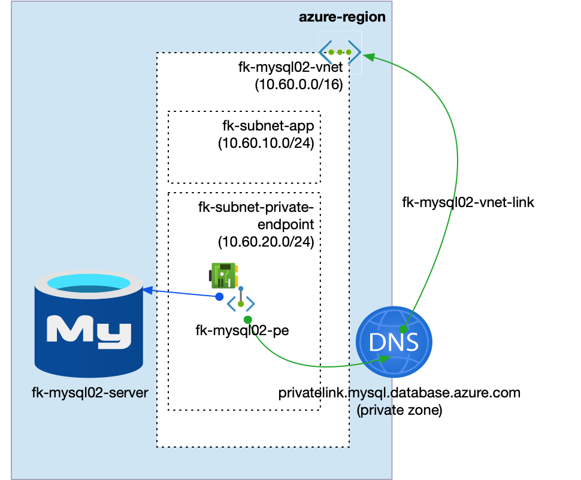
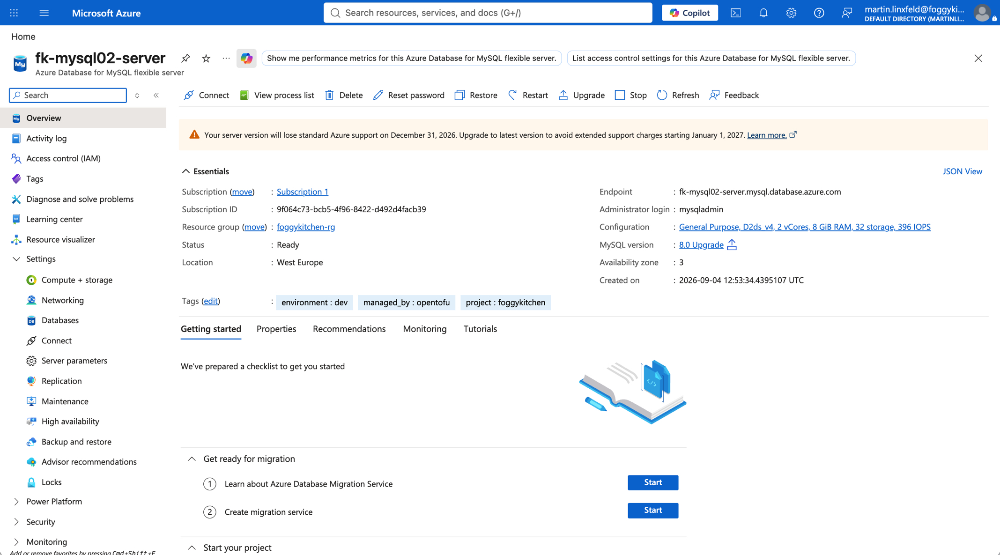
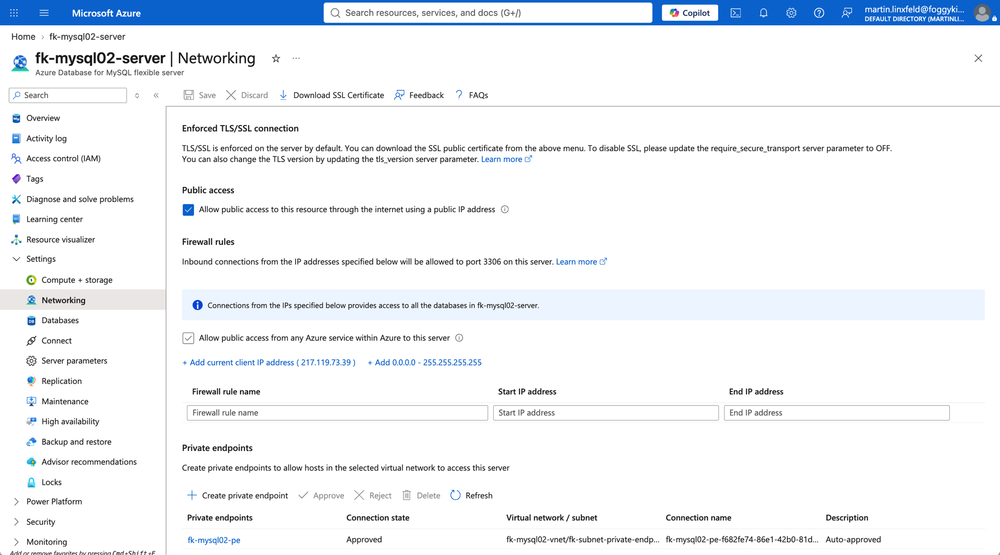
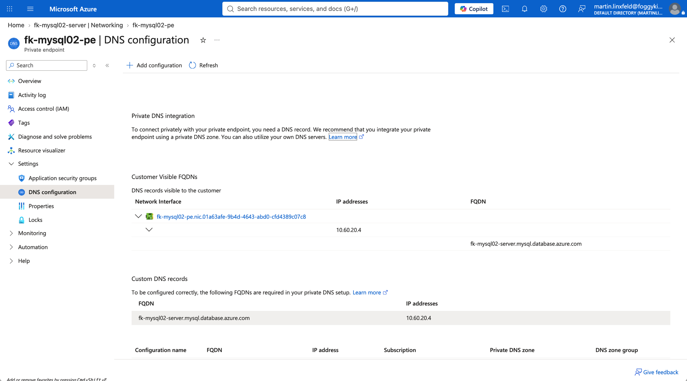

# Example 02: MySQL Private Endpoint

In this second MySQL example, we deploy an **Azure Database for MySQL Flexible Server** using **Terraform/OpenTofu** and expose it privately through **Azure Private Link**.
The Private Endpoint is created in a dedicated subnet and integrated with the recommended MySQL Private DNS Zone.

This example focuses on the **Private Endpoint deployment path**, where the MySQL server is composed with dedicated FoggyKitchen networking, Private DNS, and Private Endpoint modules.

---

## 🧭 Architecture Overview



This deployment creates:

- A dedicated **Azure Resource Group**
- One **Azure VNet** using `terraform-az-fk-vnet`
- One application subnet for future client workloads
- One subnet prepared for Private Endpoints
- One **Private DNS Zone** using `terraform-az-fk-private-dns`
- One **MySQL Flexible Server** using the local `terraform-az-fk-mysql` module
- One **Private Endpoint** using `terraform-az-fk-private-endpoint`
- One Private DNS Zone Group attached to the Private Endpoint
- One sample database named `foggydb`

This is the most direct way to understand how the MySQL module can be composed with Private Link while keeping endpoint and DNS concerns outside the root database module.

---

## 🧱 Network Layout

- **VNet CIDR:** `10.60.0.0/16`
- **Application subnet:** `10.60.10.0/24`
- **Private Endpoint subnet:** `10.60.20.0/24`
- **Private Link subresource:** `mysqlServer`
- **Private DNS Zone:** `privatelink.mysql.database.azure.com`

The MySQL Flexible Server remains an Azure PaaS resource.
Only the Private Endpoint network interface is placed inside the `fk-subnet-private-endpoint` subnet.

---

## 🚀 Deployment Steps

Copy the example variables file and set a strong MySQL administrator password:

```bash
cp terraform.tfvars.example terraform.tfvars
```

If you reuse a shared Azure training tfvars file, make sure it also provides `mysql_admin_password`.
Values such as `my_public_ip` are not used by this Private Endpoint example.

Initialize and apply the Terraform/OpenTofu configuration:

```bash
tofu init
tofu plan
tofu apply
```

After a successful deployment, OpenTofu will output:

- The MySQL Flexible Server ID
- The MySQL FQDN
- The Private Endpoint ID
- The created Private Endpoint DNS configuration in the Azure portal
- The created database IDs

---

## 🧠 Runtime Notes

After deployment, the MySQL server should:

- be associated with a Private Endpoint
- resolve through `privatelink.mysql.database.azure.com`
- expose the `foggydb` database
- accept private connectivity from clients with network path to the Private Endpoint subnet

The MySQL Private Endpoint target subresource is `mysqlServer`.
This example does not create firewall rules, so approved public traffic is enabled for the server object but no public client IPs are allowed by this configuration.
For MySQL Private Endpoint verification, use the Azure portal DNS configuration view to confirm the private IP assigned to the endpoint NIC.

---

## 🖼️ Azure Console And Runtime Verification

### MySQL Flexible Server

In the Azure portal, verify that the MySQL Flexible Server exists in the expected resource group and region.



### MySQL Networking

Confirm that the MySQL Flexible Server is associated with the Private Endpoint and that no firewall rules are required for the private access path.



### Private Endpoint DNS Configuration

Confirm that the Private Endpoint DNS configuration exposes the MySQL FQDN and private IP address from the Private Endpoint subnet.



---

## 🧹 Cleanup

To remove all resources created by this example:

```bash
tofu destroy
```

---

## ✅ Summary

This example demonstrates:

- How to deploy **Azure Database for MySQL Flexible Server** using Terraform/OpenTofu
- How to compose the MySQL module with `terraform-az-fk-private-endpoint`
- How to use `terraform-az-fk-private-dns` for Private Endpoint DNS integration
- How to use the MySQL Private Link subresource `mysqlServer`
- How to keep Private Endpoint concerns outside the root MySQL module

---

## 🌐 Learn More

Visit [FoggyKitchen.com](https://foggykitchen.com/) for Azure, OCI, multicloud, and Terraform/OpenTofu learning resources.

---

## 🪪 License

Licensed under the **Universal Permissive License (UPL), Version 1.0**.  
See [LICENSE](../../LICENSE) for more details.

---

© 2026 [FoggyKitchen.com](https://foggykitchen.com) - Cloud. Code. Clarity.
